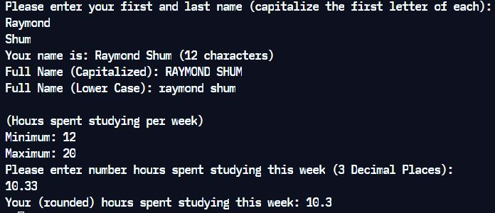

# Project 1 - String Manipulator

**Run it on Replit: https://replit.com/@raymondshum/cst338-m1** 

### _Description_ 
> This program consists of two parts. In Part 1, user input in the form of
their full name is concatenated, printed along with the length and printed in
both upper and lower case. In Part 2, two static variables are displayed,
showing the minimum and maximum ranges of hours that a student is expected to
study in a given week. The student is prompted to enter their own hours
studied, which is displayed in a rounded form.

### _Screenshots_

---

[Return to Main Page](https://github.com/raymondshum/CST338)