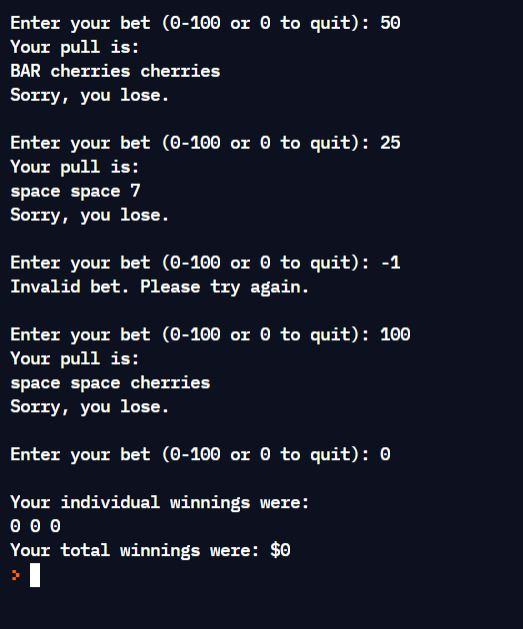

# Project 2 - Casino with Methods and a Class

**Run it on Replit: https://replit.com/@raymondshum/cst338-m2** 

### _Description_ 
> This program simulates a slot machine. The class "ThreeString" tracks the
 "display" of the slot machine and the individual and total winnings. The
 "Assig2" class is used to bet, "pull" the slot machine and calculate payout.
 Within "Assig2", the main method holds the loop that allows the user to play
 the game. Once the user exits the game, his score is displayed.
 
### _Screenshots_

