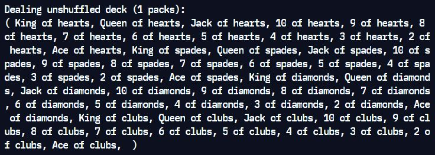
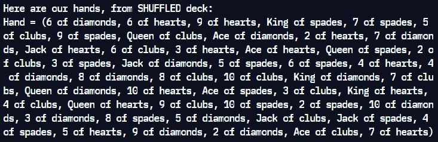

# Project 3 - Decks of Cards

**Run it on Replit: https://replit.com/@raymondshum/cst338-m3** 

### _Description_ 
> The core classes for a future game: Card, Deck and Hand classes. The Card class represents a single card from a deck of playing cards. The Deck class represents a single full deck: Ace, King, Queen, etc. The Hand class represents the current state of the cards controlled by a single player.

### _Screenshots_

