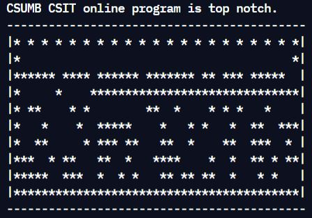
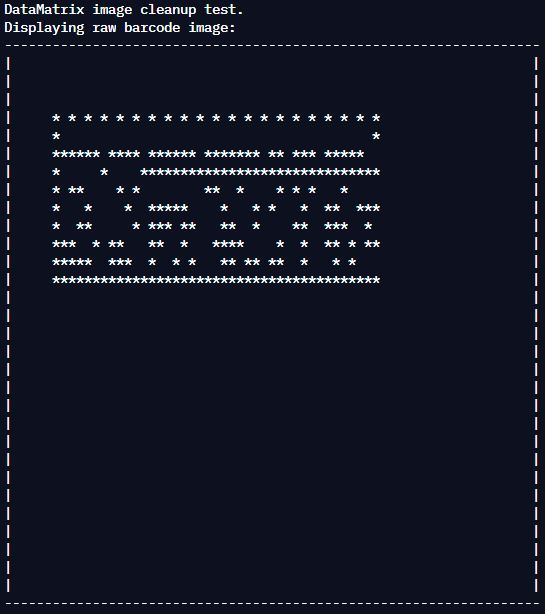
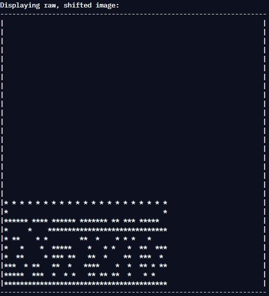
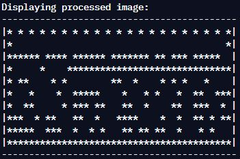

# Project 4 - Optical Barcode Readers and Writers

**Run it on Replit: https://replit.com/@raymondshum/cst338-m4** 

### _Description_ 
> This assignment uses two classes and two interfaces to scan, translate and
generate barcode images. The BarcodeImage class, which implements cloneable,
defines the dimensions of the array that holds the barcode image. It reads
and stores the barcode image. The DataMatrix class, which implements the
BarcodeIO interface, processes the image by pulling it to the lower left hand
corner of the BarcodeImage array and outputs the relevant portion to the
console. It can also generate a text string from a barcode and vice versa.

### _Screenshots_

---

[Return to Main Page](https://github.com/raymondshum/CST338)
