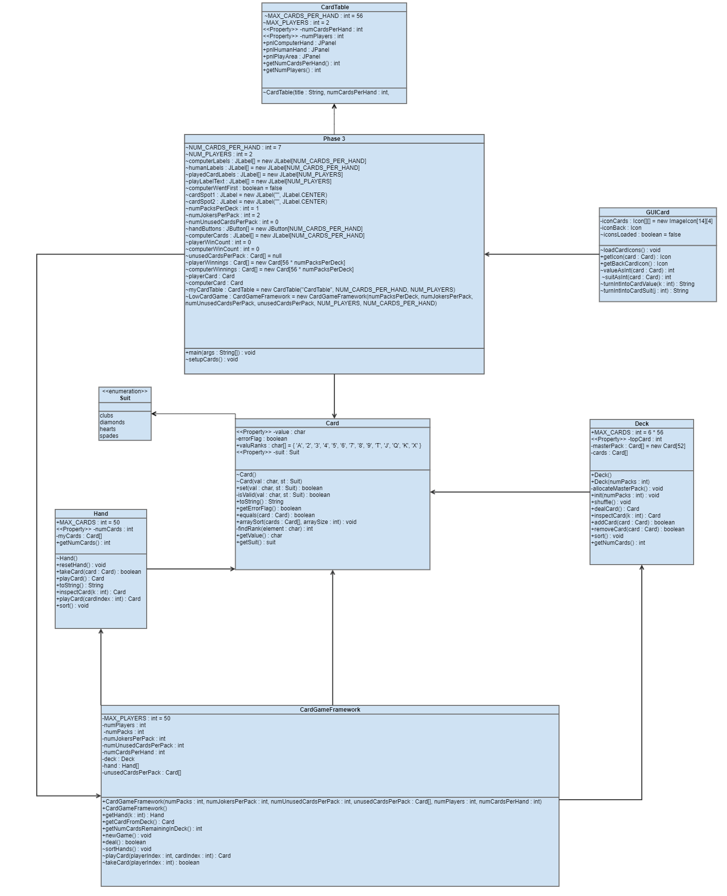
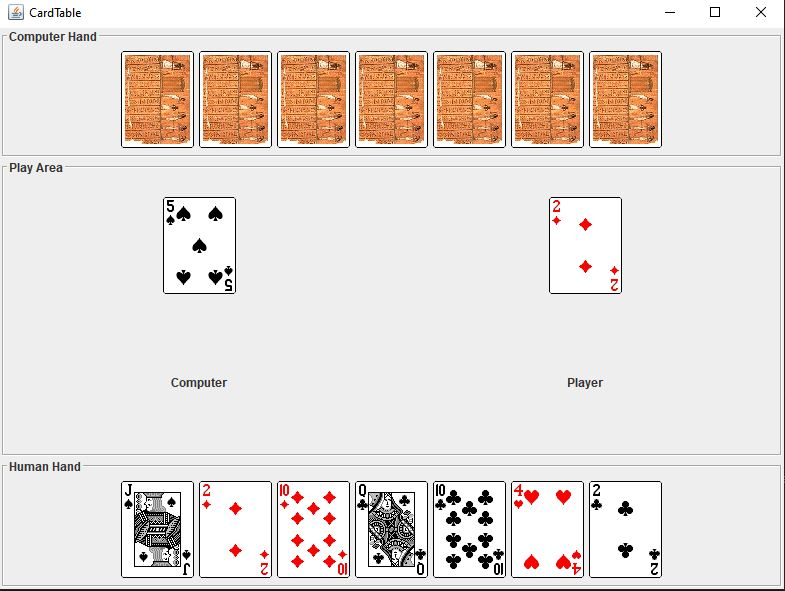
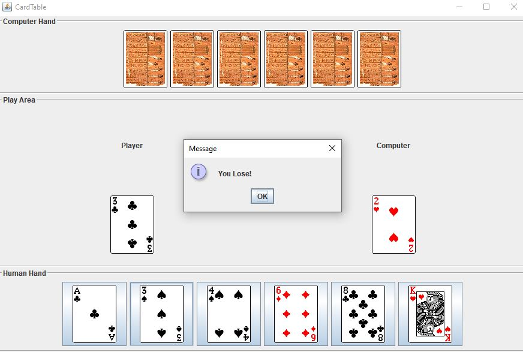
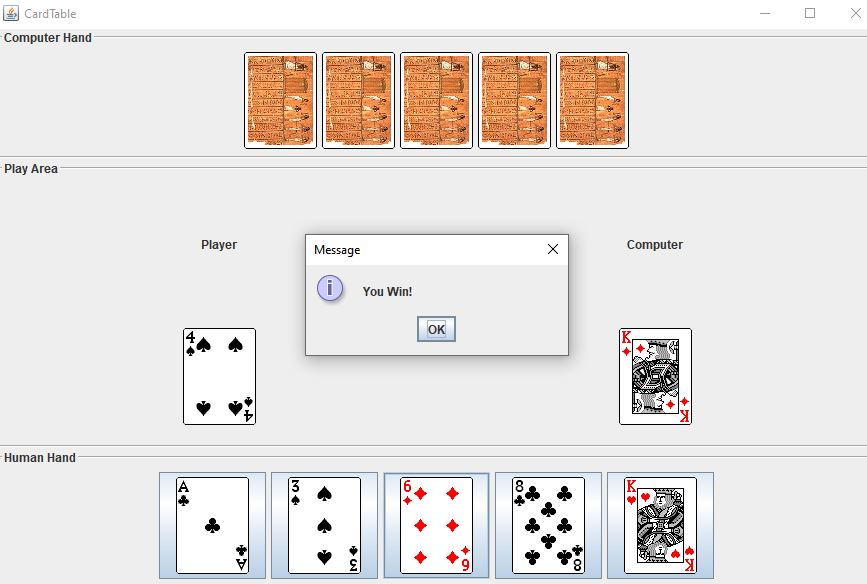

# Project 5 - Low Card Game

**Run it on Replit: https://replit.com/@raymondshum/cst338-m5** 

### _Description_ 
> This assignment uses  the cardTable, GUICard, and 
CardGameFramework classes to build an interactive game in which the goal is to 
play a card smaller in value than your opponent's. The game is played until 
hands of 7 can no longer be dealt, then a final tally is made to determine the 
overall winner.

## _UML_

### _Screenshots_

