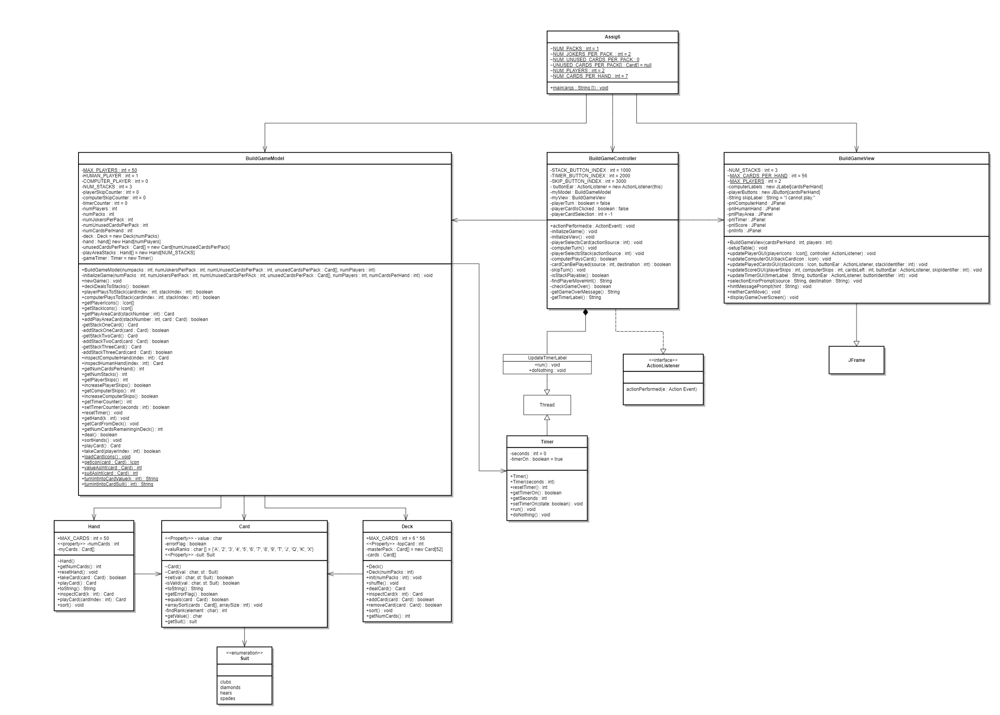
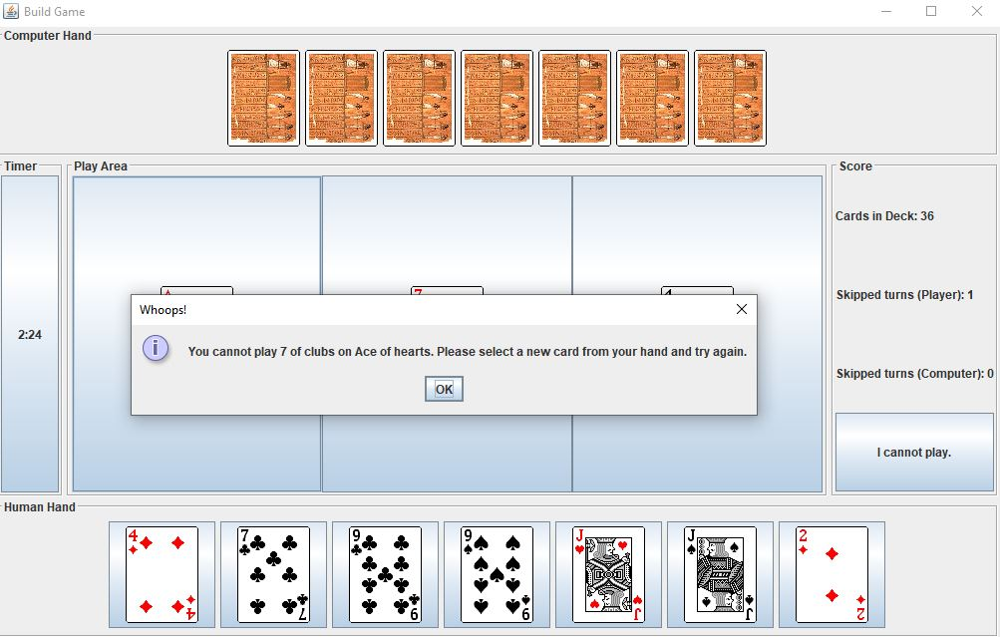
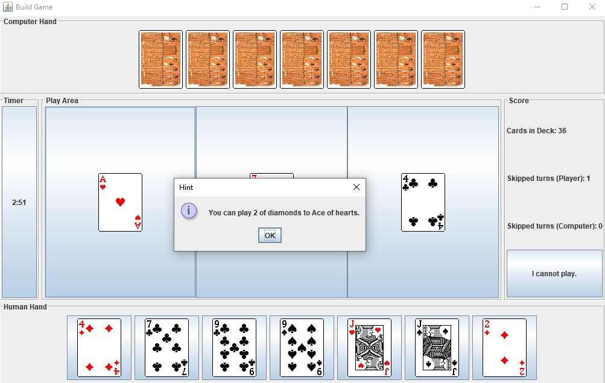
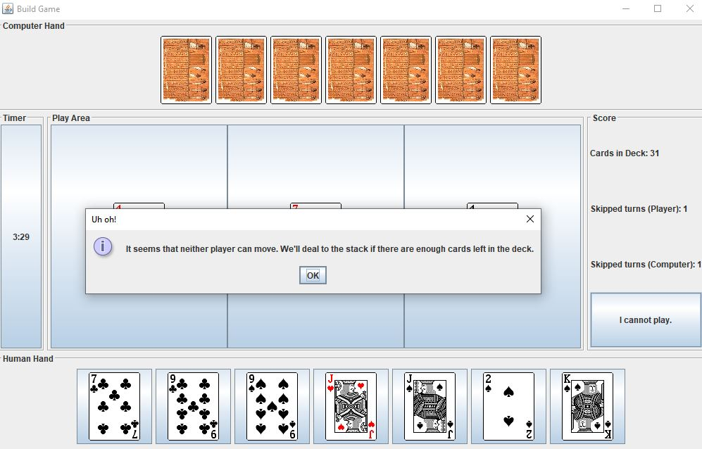
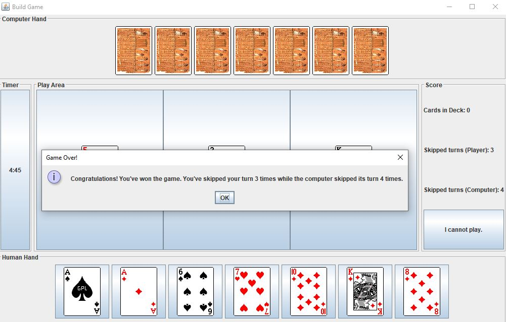

# Project 6 - Timed "Build" Game

**Run it on Replit: https://replit.com/@raymondshum/cst338-m6** 

### _Description_ 
> This assignment is the implementation of the "Build" card game, using Java Swing. We designed this using the MVC design pattern outlined in the UML below. Additionally, multithreading is implemented via the Timer class, which allows a player to start and stop a timer independently of the main thread.

## _UML_

### _Screenshots_

---

[Return to Main Page](https://github.com/raymondshum/CST338)

