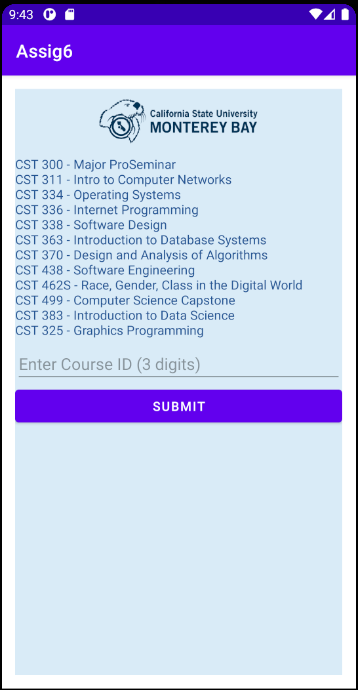
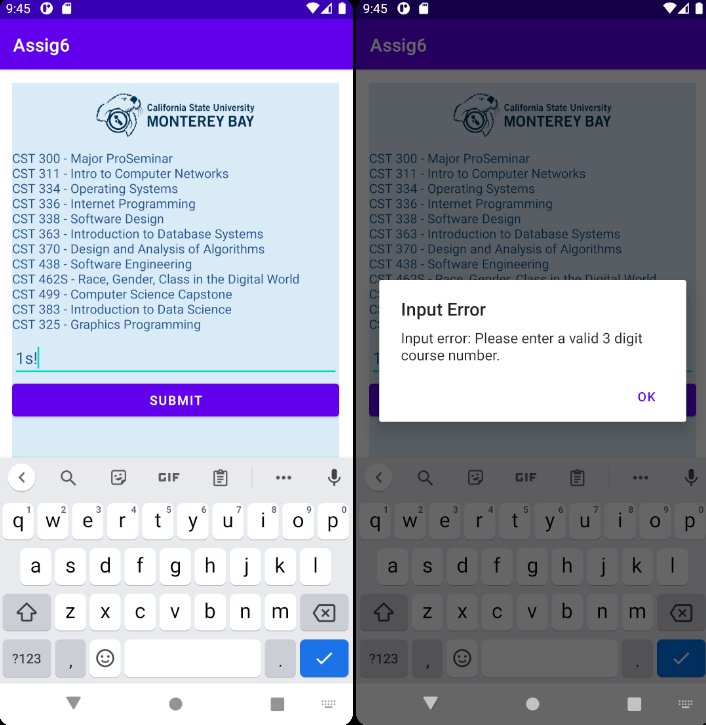
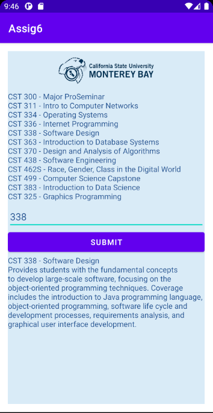
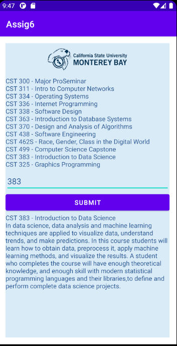

# Project 7 - Simple Android App

### _Description_ 
> For this assignment, we implemented a Simple Android App using Java and Android Studio. It allows a user to search and display course information on the program requirements of CSUMB's CSIT degree. Unfortunately, I am unable to run this on Replit, so I have attached my class presentation/walkthrough below.

### _Video Walkthrough_
https://youtu.be/V2Wc8Ii4wEQ

### _Screenshots_

